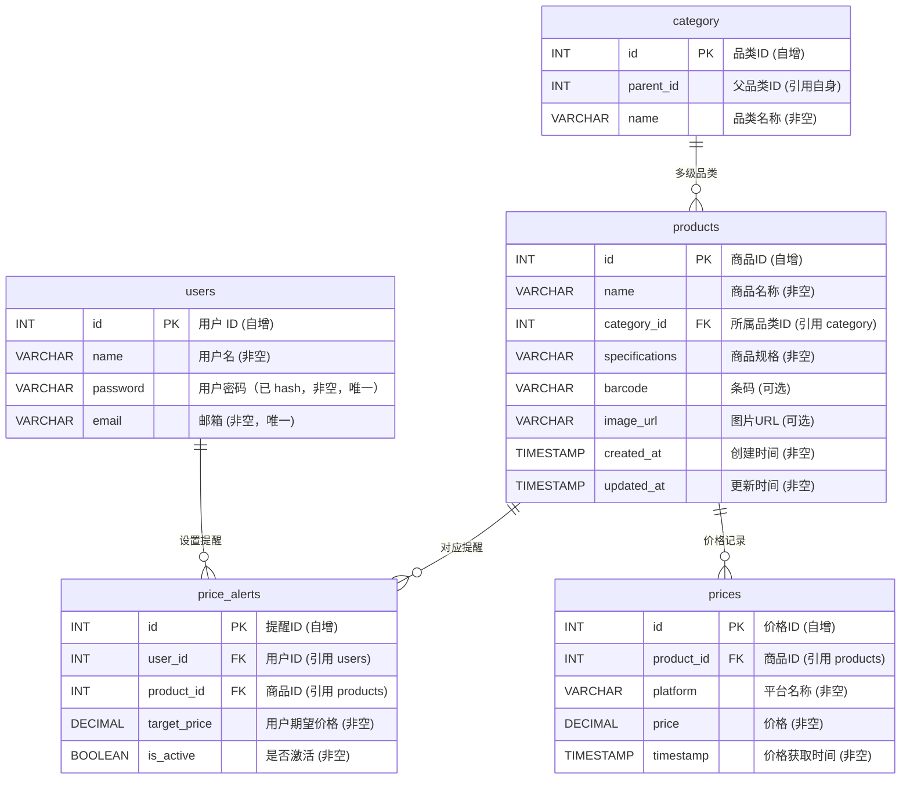

# 商品价格比较网站设计报告

## 项目背景

在当今信息爆炸的时代，消费者面临着商品选择的多样性和价格波动的挑战。因此，开发一个自动化的商品价格比较网站将为消费者带来极大便利，帮助他们快速找到最低价格的商品，节省购物时间和成本。

本项目旨在通过抓取多个电商平台的商品价格数据，并实时对比展示，让用户直观了解不同平台的价格差异。

本文档为项目的系统设计文档，涵盖了需求分析、技术选型、系统环境、数据库表设计、接口设计等内容，详细展示了该商品价格比较网站的设计情况。

该项目要求包含完整的 Web 前后端、MQTT 服务器以及相关项目文档，并且由单一人员独立完成。

## 需求分析

### 功能需求

每个用户会提出以下功能性需求：
- 用户注册、登录，及其信息验证。
- 通过商品名称在主流电商平台上查询该商品实时价格
- 商品信息展示
- 开启商品降价提醒
- 手机登录网站
- 使用手机相机拍摄商品进行查询

其中每个功能下还有若干子功能，如支持至少 2 个以上平台查询价格进行比较、历史价格图表化等。

### 非功能需求


非功能需求包括性能需求、输入输出需求、数据管理需求等等。

#### 性能需求

系统需要满足以下基本性能需求：

- 系统运行保证总体稳定流畅
- 系统支持百人级别的并发访问
- 页面适配所有主流浏览器以及手机浏览器
- 用户的操作后的系统反应时长控制在 1s 以内
- 系统可以及时检测并反馈出现的各种异常情况

#### 输入输出需求

- 在用户输入账号密码时，应对数据输入进行数据有效性检查，确保其安全性
- 在用户查询商品实时价格时，可能需要用户登录验证后才获得平台的查询结果
- 在用户查询商品实时价格时，需要将查询得到信息以可视化图表的形式展示给用户
- 在用户查询商品实时价格时，需要处理手机图片或商品条码等输入
- 在发送降价提醒时，需要将提醒信息通过邮件或APP推送给用户

#### 数据管理需求

- 系统需要保证其独立性的同时，具备和其他系统进行交互的能力
- 系统应防止未经授权的各类人员对本系统进行设置和修改或访问系统内部数据
- 系统服务器软件必须提供可靠的数据备份和恢复手段，在服务器软件或硬件出现严重故障时，能够根据备份的数据和账户信息迅速恢复正常运行环境
- 除此之外，系统应具备加密登录、数据加密传输等安全方面的保障，保证数据在不用系统间传输过程中的保密性与安全性

## 技术选型

### 总体技术选型

本项目使用前后端分离的 Web 开发。通过由后端提供 API 调用，前端调用 API 来实现用户和系统数据之间的沟通。整个项目的技术选型如下：

- 前端：以 React 框架 Next.js 作为核心，使用 Typescript 和 Eslint 技术进行辅助开发，使用 SWR 进行数据请求，页面设计和组件使用中使用 AntD 以及 TailwindCSS 以适配移动设备，用 Chart.js 或 D3.js 在前端展示价格波动图或其他可视化效果
- 后端：以 SpringBoot 为核心，辅以 Maven 进行包管理。使用 Mybatis 与 MySQL 进行数据库的相关处理，用 JavaMailSender 实现邮件提醒
- 数据抓取：使用Playwright在淘宝、京东等需要用户登录的电商平台上实现自动化查询，使用爬虫框架Scrapy爬取静态数据的商品信息或非登录状态页面数据

### 主要技术介绍

#### 前端技术

React是一个由Facebook开发的JavaScript库，用于构建用户界面。它主要用于构建单页面应用程序（SPA），其中用户与页面交互时，只更新页面的一部分，而不是整个页面重新加载。React的核心思想是通过组件化的方式构建用户界面，使代码更具可维护性和可重用性。

Next.js是一个React框架，它简化了React应用的开发过程并提供了服务器渲染和静态生成等性能优化功能。通过Next.js，可以轻松实现页面路由、自动代码拆分以提高加载速度，并享有内置的CSS支持。它还简化了服务器端渲染（SSR）的实现，使得构建快速、可扩展的React应用变得更加容易。

Chart.js 是一个免费开源的JavaScript 资料视觉化工具库，支持 8 种图表类型：条形图、折线图、面积图、圆饼图、气泡图、雷达图、极坐标图和散点图

SWR（Stale-While-Revalidate）是一个React Hooks库，用于数据获取和缓存。它通过在组件渲染时返回缓存的数据，然后在后台重新获取最新数据，从而实现了快速显示旧数据，并在后台更新以确保数据的新鲜性。SWR还提供了一些优化策略，例如自动重试和缓存过期，使数据获取变得简单而高效。它特别适用于构建React应用程序中的数据层，提供了简洁而强大的工具来处理数据的获取和管理。

Ant Design（AntD）是一个由阿里巴巴设计团队开发的React组件库，旨在提供美观、实用的UI组件和设计规范。AntD的组件丰富而灵活，覆盖了各种常见的Web应用场景，包括表单、表格、导航等。通过AntD，开发者可以快速构建现代化的用户界面，同时保持一致的设计风格。AntD还提供了丰富的文档和社区支持，使其成为许多React开发者的首选UI库。

Playwright 是一个由 Microsoft 开发的用于浏览器测试和网页抓取的开源自动化库。它支持多种浏览器，包括 Chromium、Firefox 和 WebKit，并提供了简单而强大的API，用于模拟用户操作、执行JavaScript代码和获取页面内容。通过Playwright，可以轻松实现网页抓取、自动化测试和数据采集等任务，从而提高开发效率和质量。

#### 后端技术

Spring Boot是基于Spring框架的一个简化、约定优于配置的开发框架，旨在快速搭建基于Java的生产级别的应用程序。它通过默认配置和自动化，简化了Spring应用的开发过程，使开发者能够更专注于业务逻辑而不必过多关注配置细节。Spring Boot提供了内嵌的Web服务器、丰富的起步依赖、自动化配置等特性，使得构建和部署Java应用变得更加轻松高效。

MyBatis是一个基于Java的持久层框架，它通过使用简单的XML或注解配置来映射Java对象与数据库表之间的关系。MyBatis的设计思想是提供轻量级、灵活且可定制的持久层解决方案，使开发者能够更好地控制SQL语句和数据库操作。它支持动态SQL、自动映射、缓存等特性，同时避免了大量的样板代码，简化了数据库访问的操作。MyBatis广泛应用于Java项目中，为开发者提供了一种简单而强大的数据访问方式。

MySQL 是一个流行的开源关系型数据库管理系统（RDBMS），广泛用于各种规模的应用程序开发和管理数据。从小型网站到大型企业级应用，因其稳定性、性能和开源性而备受青睐。MySQL 在数据存储和管理方面提供了强大的功能，适合不同规模和需求的项目。


### 系统环境

#### 软件环境

- 操作系统：Linux & Windows 11
- 数据库：MySQL 8.0 及以上
- 浏览器：Chrome

#### 硬件环境

CPU：Intel Core i5 及以上
内存：4GB 及以上
硬盘：256GB SSD 及以上
网络：具有良好的网络连接和数据传输能力

## 数据库表设计

本系统设计了五张表，分别为用户信息表、商品信息表、多级品类表、商品价格表和降价提醒表。这些表之间通过外键关联建立了关系，以实现数据的一致性和完整性。

#### 用户信息表(`users`)

| 字段     | 类型         | 描述                | 备注         |
| -------- | ------------ | ------------------- | ------------ |
| id       | INT          | 用户 ID             | 自增、主键   |
| name     | VARCHAR(128) | 用户名              | 非空         |
| password | VARCHAR(128) | 用户密码（已 hash） | 非空、UNIQUE |
| email    | VARCHAR(128) | 邮箱                | 非空、UNIQUE |


#### 商品信息表(`products`)

| 字段名        | 类型          | 描述                    | 备注 |
|---------------|--------------|-------------------------|-----|
| id            | INT  		   | 商品ID                |自增、主键|
| name          | VARCHAR(128) | 商品名称               |非空|
| category_id      | Int          | 所属品类               |非空，引用`category`表|
| specifications| JSON/VARCHAR | 商品规格               | 非空 |
| barcode       | VARCHAR(128) | 条码             | 可选 |
| image_url     | VARCHAR(128) | 图片URL                |可选|
| created_at    | TIMESTAMP    | 创建时间               |非空|
| updated_at    | TIMESTAMP    | 更新时间               |非空|

#### 多级品类表(`category`)
| 字段名        | 类型          | 描述                    | 备注 |
|---------------|--------------|-------------------------|-----|
| id            | INT  		   | 品类ID                |自增、主键|
| parent_id     | INT          | 父品类ID               |可选，可引用自身|
| name          | VARCHAR(128) | 品类名称               |非空|


#### 商品价格表(`prices`)
| 字段名        | 类型          | 描述                    | 备注 |
|---------------|--------------|-------------------------|-----|
| id            | INT  		   | 价格ID                |自增、主键|
| product_id    | INT          | 商品ID               |非空，引用`products`表|
| platform      | VARCHAR(128) | 平台名称               |非空|
| price         | DECIMAL	   | 价格               |非空|
| timestamp    | TIMESTAMP    | 价格获取时间               |非空|

#### 降价提醒表(`price_alerts`)
| 字段名        | 类型          | 描述                    | 备注 |
|---------------|--------------|-------------------------|-----|
| id            | INT 		   | 提醒ID                  |自增，主键|
| user_id       | INT          | 用户ID                  |非空，引用`users`表|
| product_id    | INT          | 商品ID                  |非空，引用`products`表|
| target_price  | DECIMAL      | 用户期望价格               |非空|
| is_active     | BOOLEAN      | 是否激活                |非空|


### ER图


### 接口设计

本接口设计主要用于系统的前后端交互。我们使用 SpringBoot 的路由功能监听前端发送的请求，请求和传递数据的时候均使用 JSON 格式。后端返回的数据符合 RESTFUL 格式，由前端统一使用 axios 前处理器解包。

```json
{
	"code": "0", // 0 表示未出错，同时 message 为空，其余表示出错
    "data": {
        //....
    },
    "message": "",
}
```

#### 用户模块
1. 用户注册
- 接口路径: POST /api/users/register
- 描述: 新用户注册
- 请求参数:
  - username: 用户名 (字符串，必填)
  - password: 密码 (字符串，必填，需加密传输)
  - email: 邮箱 (字符串，必填，格式验证)
- 响应:
  - 成功: 注册成功信息
  - 失败: 错误信息（如用户名或邮箱已存在）
2. 用户登录
- 接口路径: POST /api/users/login
- 描述: 用户登录，返回用户会话令牌
- 请求参数:
  - email: 邮箱 (字符串，必填)
  - password: 密码 (字符串，必填)
- 响应:
  - 成功: 返回 JWT 令牌
  - 失败: 错误信息
3. 获取用户信息
- 接口路径: GET /api/users/me
- 描述: 获取当前登录用户的信息
- 请求参数: 无
- 响应:
  - 成功: 用户信息
  - 失败: 未授权错误


#### 商品模块
1. 查询商品
- 接口路径: GET /api/products/search
- 描述：根据商品名称查询商品
- 请求参数：
  - name: 商品名称 (字符串，必填)
- 响应：
  - 成功：商品信息
  - 失败：错误信息
2. 获取商品详情
- 接口路径: GET /api/products/{id}
- 描述：根据商品ID获取商品详情
- 请求参数：
  - id: 商品ID (整数，必填)
- 响应：
  - 成功：商品详情
  - 失败：错误信息

#### 价格模块
1. 查询商品价格
- 接口路径: GET /api/prices/{product_id}
- 描述：根据商品ID查询商品价格
- 请求参数：
  - product_id: 商品ID (整数，必填)
- 响应：
  - 成功：商品价格信息
  - 失败：错误信息
2.  获取商品历史价格
- 接口路径: GET /api/prices/history/{product_id}
- 描述：根据商品ID获取商品历史价格
- 请求参数：
  - product_id: 商品ID (整数，必填)
- 响应：
  - 成功：商品历史价格信息
  - 失败：错误信息

#### 降价提醒模块
1. 设置降价提醒
- 接口路径: POST /api/alerts
- 描述: 为商品设置降价提醒
- 请求参数:
  - product_id: 商品ID (必填)
  - target_price: 期望价格 (必填)
- 响应:
  - 成功: 提醒设置成功信息
  - 失败: 错误信息
2. 获取降价提醒
- 接口路径: GET /api/alerts
- 描述: 获取用户的降价提醒列表
- 请求参数: 无
- 响应:
  - 成功: 返回用户的降价提醒列表
  - 失败: 错误信息
3. 删除降价提醒
- 接口路径: DELETE /api/alerts/{alert_id}
- 描述: 删除指定的降价提醒
- 请求参数: alert_id 降价提醒ID
- 响应:
  - 成功: 提醒删除成功信息
  - 失败: 错误信息  

### 项目进度安排

- 2024.11
  - 前半月初步完成系统设计，学习相关技术栈
  - 后半月搭建系统框架雏形
- 2024.12
  -  前半月完成系统前后端开发
  -  后半月进行系统测试，并撰写实验报告